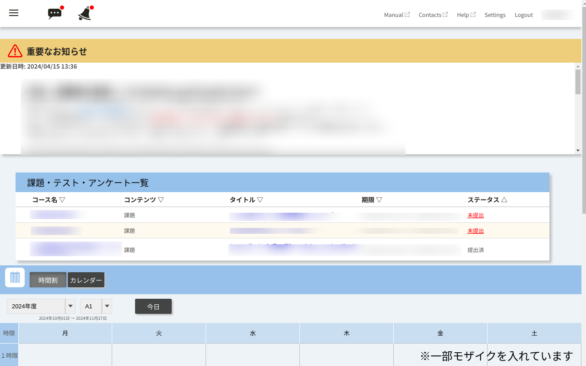

# ITC-LMSのトップページに「課題・テスト一覧」を表示させるやつ

## 更新情報
- v1.0.1 2021/11/17  
  時間割ページに「重要なお知らせ」欄が存在しないときに拡張機能が働かなくなっていた問題を修正しました

- v2.0.0 2021/12/13  
  新機能追加
  - 期限が近い課題のハイライト機能
  - 科目名を指定して非表示にする機能
  - 上記の項目の設定ページ
  
## 概要
ITC-LMSの時間割ページ
https://itc-lms.ecc.u-tokyo.ac.jp/lms/timetable
に課題・テスト一覧ページから取ってきたデータを挿入して表示させるためのGoogle Chrome拡張機能です。

    

## 導入方法
1. このリポジトリをGitHubからクローンするか、zipファイルとしてダウンロードして(画面上方の`Code`と書かれた緑色のボタンからできます)、自分のコンピュータの好きな場所に置いてください。
2. Google Chromeを起動し、拡張機能の管理ページ(`chrome://extensions`からアクセスできます)で、画面右上のトグルボタンをクリックしてChromeのデベロッパーモードをオンにします。
3. デベロッパーモードを起動すると表示されるバーの一番左の「パッケージ化されていない拡張機能を読み込む」というボタンを押し、先程このリポジトリをダウンロードしたフォルダを選択します。
4. 以上で準備は完了です。